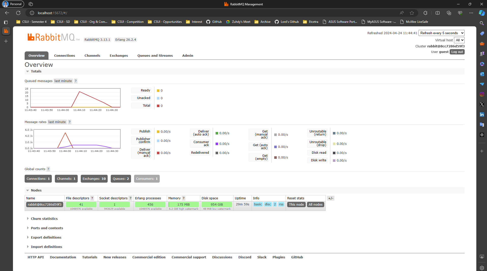

1.  What is amqp?
    
    AMQP atau Advanced Message Queing Protocol adalah sebuah messaging middleware yang memungkinkan sebuah sistem dapat berkomunikasi satu sama lain secara asynchronus.

    AMQP memiliki standard tertentu yang dapat berjalan terlepas dari platform maupun bahasa pemrograman yang digunakan dengan menggunakan suatu aturan dan format khusus.

    Pada tutroial ini, AMQP digunakan dalam penggunaan CrosstownBus yaitu untuk melakukan setup pada queue listener. Ini memungkinkan sistem menjadi loosly coupled dan memungkinkan sistem dapat berkomunikasi satu sama lain secara asynchronus.

2.  what it means? guest:guest@localhost:5672 , what is the first quest, and what is the second guest, and what is localhost:5672 is for?

    guest:guest@localhost:5672 merupakan sebuah URI yang digunakan untuk mengakses RabbitMQ. URI ini terdiri dari beberapa bagian yaitu:
    
    - guest:guest merupakan username dan password yang digunakan untuk mengakses RabbitMQ. Keduanya merupakan data credential yang digunakan pada AMQP. Secara default, username dan password default adalah guest:guest.
    - localhost:5672 merupakan alamat dan port dimana RabbitMQ berjalan. Pada kasus ini berjalan pada localhost dan port 5672.

    URI ini digunakan untuk mengakses AMQP dan melakukan setup pada queue listener.

#### Slow rate simulation

Terlihat bahwa peak activity menunjukkan angka 20, hal ini disebabkan saya menjalankan program publisher sebanyak 4 kali dimana setiap 1 program mengirimkan 5 buah message, sehingga total message yang dikirimkan adalah 20. 

Selain itu, terlihat bahwa message rate yang dikirimkan oleh publisher ke subscriber terhambat pada angka 1 message per second. Hal ini disebabkan oleh waktu yang dibutuhkan oleh publisher untuk mengirimkan message ke RabbitMQ membutuhkan ten milisecond.